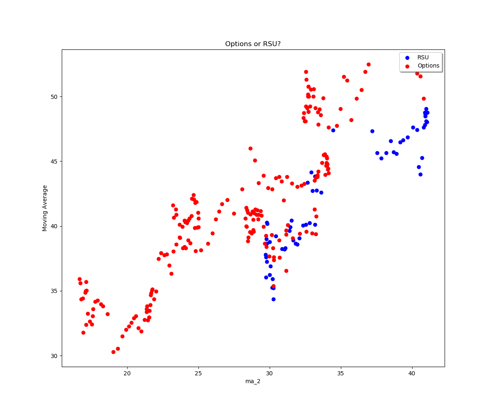
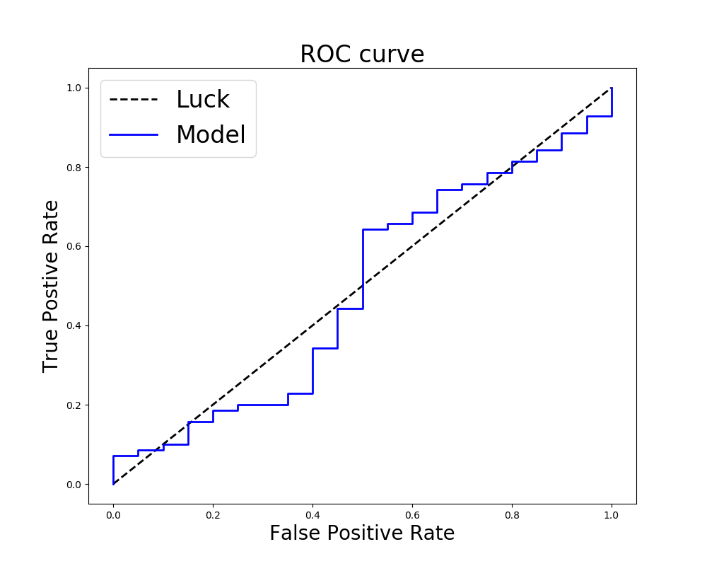
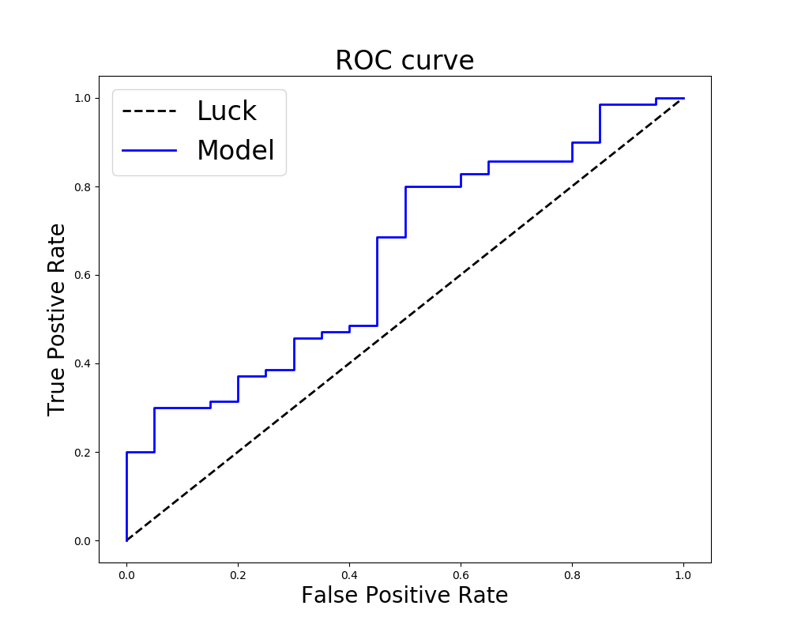
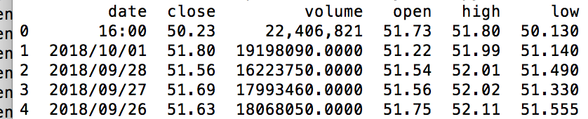
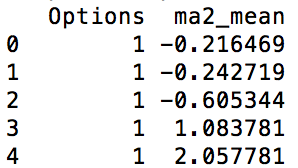
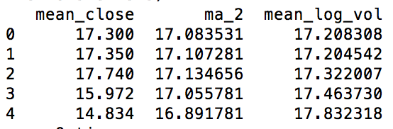
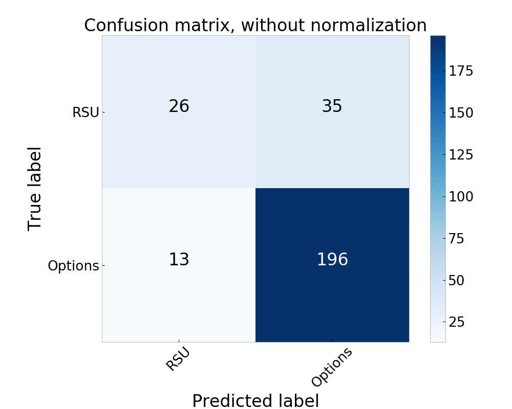

# Models to predict equity retention bonus

Authors: Chris Enyeart 
Web site: https://github.com/enyeartc/capstone1

## Description:
In order to reward and retain talent some companies offer Stock Options, this is the right to purchase stock at a specific price.  If I have an option to buy stock at $40 and the stock is at $50 I make $10.  If the stock is at $30 I have nothing.  You can by options that allow you to make money if the stock drops, but these are not used for retention and will not be discussed here.  As one would guess employees are not incentivized to stay at a company if the options are worthless, so some companies started offering Restricted Stock Units as a way to guarantee a bonus.   This is giving actual stock to an employee at a lower price but less shares than the options.   If you are awarded 1,000 shares you have a choice between 1,000 stock options or 250 RSUs or 500 stock options and 125 RSUs  Vested over 4 years.   

The question really comes down to should an employee choose Restricted Stock Units (RSU's) that have a guarantee value.  Or choose options where they could make 4 times the amount.

## Case Study Goal
To accurately create a model that will predict if an employee should choose Options or RSU's.

## Strategy 
Although there are three choices, this project will only see if an employee should choose options or not.  In order to do this I will plot a regression model, find a threshold value that will maximize the F1 value (discussed below) and this will attempt to predict if an employee should pick options or not.

## Data   
Initially data looks like the following, this data doesn't help for future predictions at a row by row level. A 0 or 1 is needed to indicate if they should pick options.  To get this value the future values will be calculated. 
### Initial Data

### Scrubbed Data with future values
If you notice there might not be any data for the exact day 4 years out due to weekends and holidays.  To model this data it needs to manipulated and collapsed.  Need to find the Monday of the week and get the mean for next 7 days etc.   There is a monthly moving average and a 4 month moving average, and now only one record for each week and the stock price is a mean for the week.  In addition the future value of the Options and RSU are calculated, if the Options value is higher then a 1 is in the 'Options' column.  For example if an employee picks 1000 options and the price is $30 when granted, and the price in 4 years is $35 then the differnce is $5 * 1000, for $5,000 total.   For the RSU's the price is simply $35 * 250 or $8750, in this case the value would be 0 for RSU's.  
In the first line below the stock moved from 17.3 to 34.989  a difference of 17.6879 or $17,685 but for RSU's it would be 34.989 * 250 or $8747.25.

visualized below

Visualized below are NaN values. Notice data at the end for 4 years that would need to removed since it takes 4 years to fully vest, the zebra pattern in middle column is becasue of weekends and holidays this will be removed when compressed to weekly mean prices.

After collapsing the data, data is clean and ready to model

The total rows was 270 weeks of data to analize.  Of this data the choice of Options was 209 out of the 270 which is 77%.  This makes it more difficult to improve over just picking Options. For example the current data is as follows.
1    209 Pick Options
0     61 Pick RSU's

### Map Moving Average to Future Mean

## Modeling
I ended up using a logistic regression using the Weekly Mean and the Moving Average for 4 weeks.  So the Options is the y or target and the X values being Mean and Moving Average.  
Options  Mean_Close MovingAverage
1        39.1420    36.451875
1        38.3060    36.725625
1        38.2960    36.952000
0        38.8940    37.205250
0        40.7760    37.561719
0        39.8720    37.859344

I was trying to get the very narrow line between some of the Options and RSU.  This proved very difficult

Using this model I could plot a ROC curve (Receiver operating characteristic)

I ran multiple passes using different thresholds and I ended up using a threshold of 0.6443742. I was using the F1 value of my model to 
Accuracy = TP+TN/TP+FP+FN+TN
Precision = TP/TP+FP
Recall = TP/TP+FN
F1 Score = 2*(Recall * Precision) / (Recall + Precision)

**************** ROC Curve Test 1.9425746049638208
Test accuracy_score 0.8444444444444444
Test precision_score 0.9
Test recall_score 0.9
Test f1_score 0.9

**************** Return All 1's
accuracy_score 0.7777777777777778
precision_score 0.7777777777777778
recall_score 1.0
f1_score 0.8750000000000001

### Scrubbed Data collapsed to weekly

### Scrubbed Data with future values
If you notice there might not be any data for the exact day 4 years out, so what we really want is the mean price for the week 4 years in advance compared to the mean price/volume/high/low 

### Eventually predict with this data

### Eventually predict with this data

