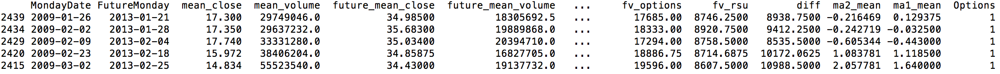

# Models to predict equity retention bonus

Authors: Chris Enyeart 
Web site: https://github.com/enyeartc/capstone1

## Description:
In order to reward and retain talent some companies offer Stock Options, this is the right to purchase stock at a specific price.  If I have an option to buy stock at $40 and the stock is at $50 I make $10.  If the stock is at $30 I have nothing.  You can by options that allow you to make money if the stock drops, but these are not used for retention and will not be discussed here.  As one would guess employees are not incentivized to stay at a company if the options are worthless, so some companies started offering Restricted Stock Units as a way to guarantee a bonus.   This is like giving actual stock to an employee at a lower price but less shares than the options.   If you are awarded 1,000 shares you have a choice between 1,000 stock options or 250 RSUs or 500 stock options and 125 RSUs  Vested over 4 years.   

The question really comes down to should an employee choose Restricted Stock Units (RSU's) that have a guarantee value.  Or choose options where they could make 4 times the amount.

## Case Study Goal
To accurately create a model that will predict if an employee should choose Options or RSU's.

## Strategy 
This project will only see if an employee should choose options or not.  In order to do this I will create a Logistic Regression model, find a threshold value that will maximize the F1 value (discussed below) and this will attempt to predict if an employee should pick options or not.

## Data   
Initially data looks like the following, this data doesn't help for future predictions at a row by row level. A 0 or 1 is needed to indicate if they should pick options.  To get this value the future values will be calculated. 
### Initial Data

### Scrubbed Data with future values
There may not be any data for the exact day 4 years out due to weekends and holidays.  To model this data it needs to manipulated and collapsed.  Need to find the Monday of the week and get the mean for next 7 days etc.   There is a monthly moving average and a 4 month moving average, and now only one record for each week and the stock price is a mean for the week.  

In addition the future value of the Options and RSU are calculated, if the Options value is higher then a 1 is in the 'Options' column.  For example if an employee picks 1000 options and the price is $30 when granted, and the price in 4 years is $35 then the differnce is $5 * 1000, for $5,000 total.   For the RSU's the price is simply $35 * 250 or $8750, in this case the value would be 0 for RSU's.  
In the first line below the stock moved from 17.3 to 34.985  a difference of 17.685 or $17,685 but for RSU's it would be 34.985 * 250 or $8746.25, since th options are much greater this is a 1.  Also interesting was the moving average calculation, this involved calculating a 'rolling' average across the previous rows.

This is visualized below

Visualized below are NaN values. Notice data at the end for 4 years that would need to removed since it takes 4 years to fully vest, the zebra pattern in middle column is becasue of weekends and holidays this will be removed when compressed to weekly mean prices.

After collapsing the data, data is clean and ready to model

The total rows was 270 weeks of data to analize.  Of this data the choice of Options was 166 out of the 270 which is 61%.  If you look at row 2 you can see what this model will attempt to capture, we want to predict the Future mean based on the current mean and moving average.  These will be used in the model.

1    166 Pick Options
0    104 Pick RSU's

### Map Moving Average to Future Mean
You can see below with a OLS (Ordinary Least Squares) line that there is a relationship between the future value of the stock and the current value but it will prove to be very difficult to predict. 

## Modeling
I used a logistic regression model using the Weekly Mean and the Moving Average for 16 weeks.  So the Options column is the y or target and the X values being Mean and Moving Average.  The other two columns are displayed for reference.

Markdown | Less | Pretty
--- | --- | ---
*Still* | `renders` | **nicely**
1 | 2 | 3

| In Model      |               |               | Not in Model      |             |
|               |               |               |  since future     |             |
| mean_close    | ma_2          | Options       | future_mean_close	| diff        |
| ------------- | ------------- | ------------- |:-----------------:| ----------- |
| 33.78	        | 31.95         | 1             | 43.0375           |  812.5      |
| 33.773        | 32.23         | 1             | 43.148	          |  931.75     |
| 34.04         | 32.23         | 1             | 43.252            |  702        |

In Model                                  Not in Model since it is in future

mean_close  ma_2	      Options		        future_mean_close	  diff

33.78	      31.95415938	1		              43.0375	            812.5

33.773	    32.23725313	1		              43.148	            931.75

34.04	      32.23040938	1		              43.252	            702

35.26	      32.6754875	0		              43.352	            -723

35.46	      32.9252375	0		              44.166	            -159

With this model I was trying to get the very narrow line between some of the Options and RSU.  This proved very difficult

Using this the following ROC (Receiver operating characteristic) is created.

I ran multiple passes using different thresholds and I ended up using a threshold of 0.45177236. I was using the F1 value of my model to find the best threshold.  To refresh your memory the following could have been used. I chose the F1 since it is a good mix of the other columns. 

Accuracy = TP+TN/TP+FP+FN+TN
Precision = TP/TP+FP
Recall = TP/TP+FN
F1 Score = 2*(Recall * Precision) / (Recall + Precision)

⋅⋅* For my testset I received the following 

Test accuracy_score   0.7444444444444445

Test precision_score  0.9444444444444444

Test recall_score     0.6181818181818182

Test f1_score         0.7472527472527473

This seems pretty good until I ran a test where my model only returned Options

⋅⋅* Only return 1's

All1 accuracy_score 0.6166666666666667

All1 precision_score 0.6166666666666667

All1 recall_score 1.0

All1 f1_score 0.7628865979381444

To understand this a bit, the difficult part was really the data where data overlaps. To see this with the actual and predicted values you can see that there are quite a few 

[1 1 1 1 1 0 0 0 0 1 1 0 1 1 1 1 0 0 1 1 1 1 0

[1 1 0 0 1 0 0 0 0 0 1 0 1 1 1 0 0 1 0 1 1 1 1

## Summary
Trying to predict a model that depends on a date several years in the future in an area of constant change like the stock market is very difficult.   The model I created did create a higher percision and accuracy score but a worse F1 score.  This model I would not consider successful due to the model with no intelligence having similar and in one case a better score.  

## Future
It

