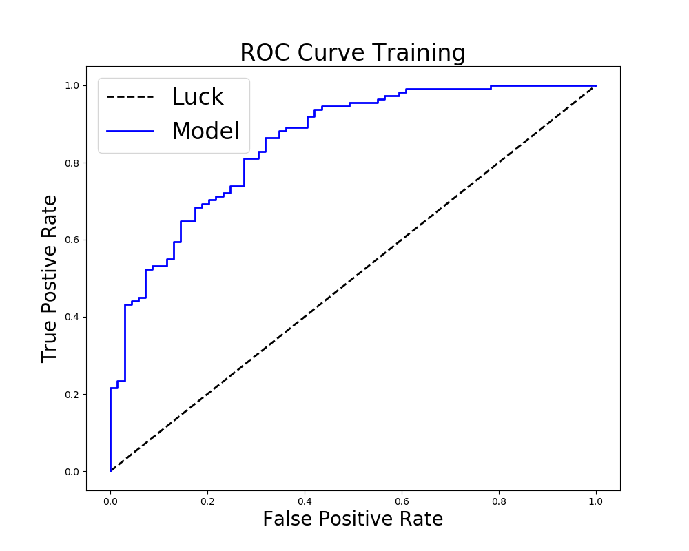

# Models to predict equity retention bonus

Authors: Chris Enyeart 
Web site: https://github.com/enyeartc/capstone1

## Description:
In order to reward and retain talent some companies offer Stock Options, this is the right to purchase stock at a specific price.  If I have an option to buy stock at $40 and the stock is at $50 I make $10.  If the stock is at $30 I have nothing.  You can by options that allow you to make money if the stock drops, but these are not used for retention and will not be discussed here.  As one would guess employees are not incentivized to stay at a company if the options are worthless, so some companies started offering Restricted Stock Units as a way to guarantee a bonus.   This is like giving actual stock to an employee at a lower price but less shares than the options. 

You have the choice between a sure thing (RSU) or a potentially much more valuable option that might turn out to be worthless.   The really hard part is these stocks will not be vested for a period of 4 years, so it is a gamble to choose either way.  This model is an attempt to make this decision easier.  If you are awarded 1,000 shares you have a choice between 1,000 stock options or 250 RSUs or 500 stock options and 125 RSUs  Vested over 4 years.   

The question really comes down to should an employee choose Restricted Stock Units (RSU's) that have a guarantee value.  Or choose options where they could make more.

## Case Study Goal
To accurately create a model that will predict if an employee should choose Options or RSU's.

## Strategy 
This project will only see if an employee should choose options or not.  In order to do this I will create a Logistic Regression model, find a threshold value that will maximize the F1 value (discussed below) and this will attempt to predict if an employee should pick options or not.  In additon numerous data points will be created in order to try and solve this problem.

## Data   
Initially data looks like the following, this data doesn't help for future predictions at a row by row level. A 0 or 1 is needed to indicate if they should pick options.  To get this value the future values will be calculated. 
### Initial Data

| field         | description          
| ------------- | ------------- 
| date          |	Day that stock was trading   
| close         |	Price at the end of the day 
| volum         |	Number of shares sold
| open          |	First price
| high          |	High price for the day
| low           |	Low price for the day

Most of these values are not important 4 years in the future.  This needs to be transformed into meaningful data for the future, the following would be more useful.
| field              | description          
| ------------------ | ------------- 
| Week               | Sum data per week not daily   
| mean_close         | Average price for the week 
| mean_volume        | Average volume for the week
| MovingAverage      | Average price for stock over last x weeks
| future_mean_close  | Average price for the week when vested
| future_mean_volume | Average volume for the week when vested
| MovingAverage      | Average price for stock over last x weeks
| fv_options         | What are 1000 options worth when vested
| fv_rsu             | What are 250 options worth when vested
| diff               | Difference between options and RSU
| Options            | Should I pick options or not?

### Scrubbed Data with future values
There may not be any data for the exact day 4 years out due to weekends and holidays.  To model this data it needs to manipulated and collapsed.  The solution needs to find the Monday of the week and get the mean for next 7 days etc.   There is a monthly moving average and a 4 month moving average, and now only one record for each week and the stock price is a mean for the week.  

In addition the future value of the Options and RSU are calculated, if the Options value is higher then a 1 is in the 'Options' column.  For example if an employee picks 1000 options and the price is $30 when granted, and the price in 4 years is $35 then the differnce is $5 * 1000, for $5,000 total.   For the RSU's the price is simply $35 * 250 or $8750, in this case the value would be 0 for RSU's.  
In the first line below the stock moved from 17.3 to 34.985  a difference of 17.685 or $17,685 but for RSU's it would be 34.985 * 250 or $8746.25, since th options are much greater this is a 1.  Also interesting was the moving average calculation, this involved calculating a 'rolling' average across the previous rows.

This is visualized below

Visualized below are NaN values. Notice data at the end for 4 years that would need to removed since it takes 4 years to fully vest, the zebra pattern in middle column is becasue of weekends and holidays this will be removed when compressed to weekly mean prices.

After collapsing the data, data is clean and ready to model

The total rows was 270 weeks of data to analize.  Of this data the choice of Options was 166 out of the 270 which is 61%.  If you look at row 2 you can see what this model will attempt to capture, we want to predict the Future mean based on the current mean and moving average.  These will be used in the model.

1    166 Pick Options
0    104 Pick RSU's

### Map Moving Average to Future Mean
You can see below with a OLS (Ordinary Least Squares) line that there is a relationship between the future value of the stock and the current value but it will prove to be very difficult to predict. 

## Modeling
I used a logistic regression model using the Weekly Mean and the Moving Average for 16 weeks.  So the Options column is the y or target and the X values being Mean and Moving Average.  The other two columns are displayed for reference.

| mean_close    | ma_2          | Options  | <-In model  |  not in model->  | future_mean_close | diff     
| ------------- | ------------- | -------- | ----------- | ---------------- | ----------------- | -------- 
|33.59	        |	34.03         |	1	       |             |                  |	45.224           |	328
|34.16	        | 34.00         |	0        |             |                  |	45.362           |	-145.5
|34.48	        |	33.98         |	0	       |             |                  |	44.664           |	-982
|33.96	        |	33.87         |	1	       |             |                  |	45.565           |	206.75

When trying to create a model, many of the field I thought would be part of the model never had a good p score like the summary below.

In the end the only field that was used with the weekly mean.  

With this model I was trying to get the very narrow line between some of the Options and RSU. See future section below for more details.

Using this the following ROC (Receiver operating characteristic) is created.

I ran multiple passes using different thresholds and I ended up using a threshold of 0.451. I was using the F1 value of my model to find the best threshold.  To refresh your memory the following could have been used. I chose the F1 since it is a good mix of the other columns. 

After gitting a threshold, I ran a 10 fold Kfold test to see if my test data would perform, I was watching the F1 score which is detailed below. 

| Test                 | Formula         
| -------------------- | ------------- 
| Accuracy             | TP+TN/TP+FP+FN+TN
| Precision            | TP/TP+FP
| Recall               | TP/TP+FN
| F1 Score             | 2*(Recall * Precision) / (Recall + Precision)

⋅⋅* For my Training data  I received the following scores

|                      | Score         
| -------------------- | ------------- 
|Test accuracy_score   |	0.7168640068640069       
|Test precision_score  |  0.7808739569609134        
|Test recall_score 	   |	0.7656126482213439     
|Test f1_score         |	0.7702914862914862       

⋅⋅* For my Final hold out data I received the following results
| Test                 | Score         
| -------------------- | ------------- 
|Test accuracy_score   |	0.7111111111111111      
|Test precision_score  |  0.7636363636363637        
|Test recall_score 	   |	0.7636363636363637     
|Test f1_score         |	0.7636363636363637  

I ran an addtional test where I forced the model to always return a 1 for options, and although the results were worse that my model I would want much better results. 

⋅⋅* Only return 1's
⋅⋅* For my testset I received the following 

| Test                 | Score         
| -------------------- | ------------- 
| All1 accuracy_score  | 0.6166666666666667
| All1 precision_score | 0.6166666666666667
| All1 recall_score    | 1.0
| All1 f1_score        | 0.7628865979381444

## Summary
Trying to predict a model that depends on a date several years in the future in an area of constant change like the stock market is very difficult.  In looking at the data there seems to be a correlation between the Past Mean Price and the Future Mean Price, as shown in images above.  Although this is great for this presentation, it makes the assumption that the company's stock price will continue to rise steadily regardless of how the current price is situated with the moving average.  It could be the data that I have lines up a bit too well with just them weekly mean.  The model performs well, but this would need more investigation.  

## Future
Although this model performed better that just guessing always options, I feel that more testing is required on different stocks and different data ranges.  I need to map the results visually with the actual values to if they line up with predictions it seems that souly the mean price for a week cannot accurately predict a price in the future.  In other words, I want to validate that if my model is accurately predicting, and this perceived improvement over chance or hard coded options isn't because of some other factor. 

