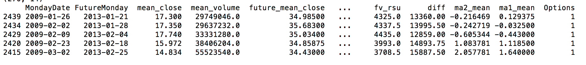

# Models to predict equity retention bonus

Authors: Chris Enyeart 
Web site: https://github.com/enyeartc/capstone1

## Description:
In order to reward and retain talent some companies offer Stock Options, this is the right to purchase stock at a specific price.  If I have an option to buy stock at $40 and the stock is at $50 I make $10.  If the stock is at $30 I have nothing.  You can by options that allow you to make money if the stock drops, but these are not used for retention and will not be discussed here.  As one would guess employees are not incentivized to stay at a company if the options are worthless, so some companies started offering Restricted Stock Units as a way to guarantee a bonus.   This is giving actual stock to an employee at a lower price but less shares than the options.   If you are awarded 1,000 shares you have a choice between 1,000 stock options or 250 RSUs or 500 stock options and 125 RSUs  Vested over 4 years.   

The question really comes down to should an employee choose Restricted Stock Units (RSU's) that have a gaureeted value.  Or choose options where they could make 4 times the ammout.

## Case Study Goal
To accurately create a model that will predict if an employee should choose Options or RSU's.

## Strategy 
Although there are three choices, this project will only see if an employee should choose options or not,  if they do not choose options they will default to RSU's.  This will involve 

## Data   
Initially data looks like the following, but this is only really good if we are predicting data for tomorrow. 
### Initial Data

### Added quit a few calculaitons

### Scrubbed Data collapsed to weekly

### Scrubbed Data with future values
If you notice there might not be any data for the exact day 4 years out, so what we really want is the mean price for the week 4 years in advance compared to the mean price/volume/high/low 

### Eventually predict with this data

### Eventually predict with this data

